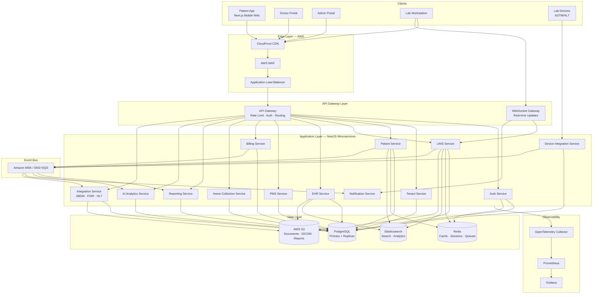
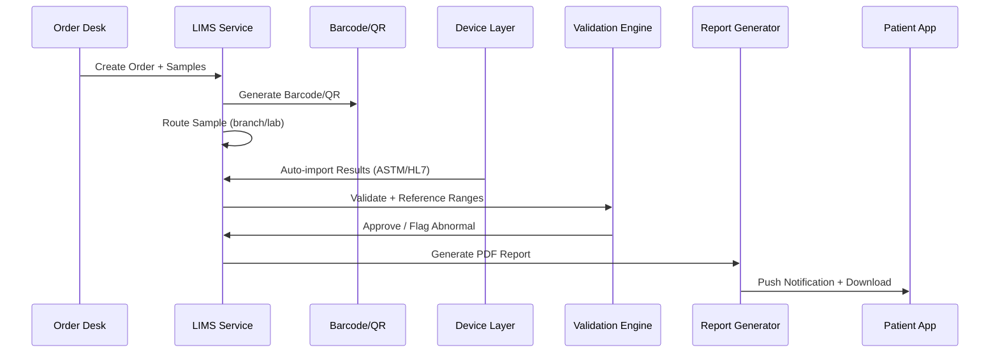
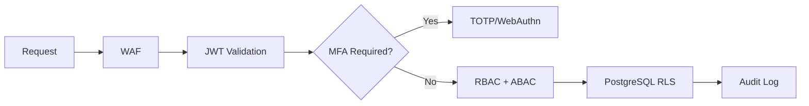

# 01 — System Architecture

## 1. Executive Summary

HealthEcosystem is a **multi-tenant, cloud-native healthcare platform** designed to serve diagnostic chains, hospital networks, franchise laboratories, and standalone clinics at enterprise scale (millions of patients, thousands of labs, hundreds of branches).

The platform follows **Clean Architecture + Domain-Driven Design (DDD)** with **CQRS** for high-throughput domains (LIMS sample processing, billing, device ingestion) and **event-driven integration** between bounded contexts.

---

## 2. Architectural Principles

| Principle | Implementation |
|-----------|----------------|
| Multi-tenancy | Row-level security + tenant_id on all domain tables; franchise hierarchy |
| Scalability | Horizontal pod autoscaling, read replicas, Redis cache, Elasticsearch search |
| Compliance | HIPAA, GDPR, DPDP, ISO 27001 controls; immutable audit logs |
| Interoperability | HL7 v2, FHIR R4, DICOM, ASTM, ABDM (ABHA, HIP, HIU) |
| Security | JWT + OAuth 2.0, MFA, RBAC/ABAC, encryption at rest & in transit |
| Observability | Prometheus metrics, Grafana dashboards, distributed tracing (OpenTelemetry) |
| Resilience | Circuit breakers, retry queues, dead-letter topics, idempotent APIs |

---

## 3. High-Level Architecture Diagram



---

## 4. Layered Architecture (Clean Architecture)

```
┌─────────────────────────────────────────────────────────────┐
│  Presentation Layer                                         │
│  Next.js 15 · Shadcn UI · React Query · Zustand             │
│  Portals: Admin · Doctor · Lab · Patient · Franchise        │
├─────────────────────────────────────────────────────────────┤
│  API Layer                                                  │
│  REST Controllers · GraphQL Resolvers · WebSocket Handlers  │
│  DTO Validation · Guards · Interceptors · Rate Limiting     │
├─────────────────────────────────────────────────────────────┤
│  Application Layer (Use Cases / CQRS)                       │
│  Commands · Queries · Handlers · Sagas · Event Handlers     │
├─────────────────────────────────────────────────────────────┤
│  Domain Layer                                               │
│  Entities · Value Objects · Aggregates · Domain Events      │
│  Repository Interfaces · Domain Services                    │
├─────────────────────────────────────────────────────────────┤
│  Infrastructure Layer                                       │
│  TypeORM Repositories · Redis · S3 · Elasticsearch          │
│  HL7/ASTM Adapters · Payment Gateways · ABDM Client         │
└─────────────────────────────────────────────────────────────┘
```

---

## 5. Bounded Contexts (DDD)

| Context | Core Aggregates | Upstream/Downstream |
|---------|-----------------|---------------------|
| **Identity & Access** | User, Role, Session, MFA | Upstream to all |
| **Tenant & Franchise** | Organization, Branch, Franchise, License | Upstream to all |
| **Patient** | Patient, UHID, FamilyProfile, Consent | Downstream: LIMS, EHR, Billing |
| **LIMS** | TestMaster, Sample, Order, Result, Report | Publishes: ResultVerified |
| **Device Integration** | Device, Adapter, RawMessage, ParsedResult | Feeds LIMS |
| **EHR** | Diagnosis, Prescription, Allergy, ClinicalNote | Consumes LIMS results |
| **PMS** | Appointment, Schedule, Queue, Teleconsult | Links Patient + Doctor |
| **Billing** | Invoice, Payment, InsuranceClaim, GSTLine | Consumes orders |
| **Home Collection** | CollectionRequest, PhlebotomistRoute | Links LIMS + Patient |
| **Reporting** | ReportTemplate, GeneratedReport, AuditExport | Consumes all |
| **AI Analytics** | Insight, RiskScore, AnomalyFlag | Consumes events |
| **Integration** | ABHAProfile, FHIRResource, HL7Message | External systems |

---

## 6. Core Data Flows

### 6.1 Sample-to-Report Lifecycle



### 6.2 Multi-Branch Order Routing

```
Collection Center → Regional Hub → Processing Lab → Verification Lab → Report Release
         │                │              │                 │
         └──── tenant_id + branch_id on every hop ────────┘
```

### 6.3 ABDM Health Information Exchange

```
Patient (ABHA) → Consent Manager → HIP (HealthEcosystem) → HIU Request
                      ↓
              FHIR Bundle (DiagnosticReport, Observation)
                      ↓
              Audit + Encryption + TTL
```

---

## 7. Device Integration Architecture

```
┌──────────────┐   ┌──────────────┐   ┌──────────────┐
│ Roche        │   │ Abbott       │   │ Sysmex       │
│ Cobas        │   │ Architect    │   │ XN-Series    │
└──────┬───────┘   └──────┬───────┘   └──────┬───────┘
       │ ASTM/HL7         │                  │
       └──────────────────┼──────────────────┘
                          ▼
              ┌───────────────────────┐
              │   Device Gateway       │
              │   TCP/Serial/MLLP      │
              └───────────┬───────────┘
                          ▼
              ┌───────────────────────┐
              │   Integration Engine   │
              │   Parse · Normalize    │
              └───────────┬───────────┘
                          ▼
              ┌───────────────────────┐
              │   Device Adapters      │
              │   Vendor-specific map  │
              └───────────┬───────────┘
                          ▼
              ┌───────────────────────┐
              │   Result Processor     │
              │   Dedup · Match Sample │
              └───────────┬───────────┘
                          ▼
              ┌───────────────────────┐
              │   Validation Engine    │
              │   QC · Delta · Panic   │
              └───────────┬───────────┘
                          ▼
              ┌───────────────────────┐
              │   LIMS Result Store    │
              │   Retry Queue · DLQ    │
              └───────────────────────┘
```

**Supported Protocols:** ASTM E1381/E1394, HL7 v2.x (MLLP), FHIR R4 (REST), DICOM (PACS/RIS ready)

**Vendor Adapters:** Roche, Abbott, Siemens, Sysmex, Beckman Coulter (extensible adapter registry)

---

## 8. PACS/RIS Ready Architecture

| Component | Role | Storage |
|-----------|------|---------|
| RIS Worklist | Imaging orders linked to LIMS/EHR | PostgreSQL |
| DICOM Gateway | C-STORE / WADO-RS | S3 + DICOM metadata in PG |
| PACS Viewer | OHIF / Cornerstone integration | Frontend module |
| HL7 ORM/ORU | Order + result messages | Integration Service |

Radiology orders flow: **EHR/PMS → RIS → Modality → PACS → FHIR DiagnosticReport → EHR**

---

## 9. Security Architecture



| Control | Detail |
|---------|--------|
| Authentication | JWT (15m access / 7d refresh), OAuth 2.0 (Google, Microsoft), SSO (SAML) |
| Authorization | RBAC with 40+ roles; branch-scoped permissions; attribute-based overrides |
| MFA | Required for admin, billing, report release; optional for patients |
| Encryption | TLS 1.3 in transit; AES-256 at rest (RDS, S3, EBS) |
| Audit | Append-only audit_logs table; 7-year retention; tamper-evident hashing |
| PII | Field-level encryption for Aadhaar, ABHA, insurance IDs |

---

## 10. Scalability Targets

| Metric | Target | Strategy |
|--------|--------|----------|
| Patients | 10M+ | Partitioned patient tables by tenant |
| Concurrent lab orders | 50K/hr | CQRS write/read split, queue-based processing |
| Device messages | 100K/min | Dedicated device ingestion pods, Redis streams |
| API latency (p95) | < 200ms | Redis cache, connection pooling, CDN |
| Report generation | 10K/min | Async workers, S3 pre-signed URLs |
| Search | < 100ms | Elasticsearch with tenant-scoped indices |

---

## 11. Technology Mapping

| Layer | Technology |
|-------|------------|
| Frontend | Next.js 15, TypeScript, Tailwind, Shadcn UI, Framer Motion, React Query, Zustand |
| Backend | NestJS, TypeScript, REST + GraphQL + WebSocket |
| Database | PostgreSQL 16, Redis 7, Elasticsearch 8 |
| Cloud | AWS (EKS, RDS, ElastiCache, S3, CloudFront, MSK) |
| Auth | JWT, OAuth 2.0, WebAuthn/TOTP MFA |
| DevOps | Docker, Kubernetes, GitHub Actions, Terraform |
| Monitoring | Prometheus, Grafana, OpenTelemetry |

---

## 12. Deployment Topology (Production)

```
Region: ap-south-1 (Primary) + ap-southeast-1 (DR)

┌─ VPC ─────────────────────────────────────────────────────┐
│  Public Subnets: ALB, NAT Gateway, CloudFront Origin      │
│  Private Subnets: EKS Worker Nodes (3 AZs)                │
│  Data Subnets: RDS Multi-AZ, ElastiCache, MSK             │
└───────────────────────────────────────────────────────────┘

EKS Namespaces:
  - health-platform-prod
  - health-platform-staging
  - health-device-ingestion (isolated for lab network)
  - monitoring (Prometheus, Grafana)
```

---

## 13. Phase 1 Approval Checklist

- [ ] Bounded contexts and service boundaries approved
- [ ] Data flow for sample lifecycle approved
- [ ] Device integration approach approved
- [ ] Security and compliance controls approved
- [ ] Scalability targets acceptable
- [ ] Proceed to database schema + implementation
