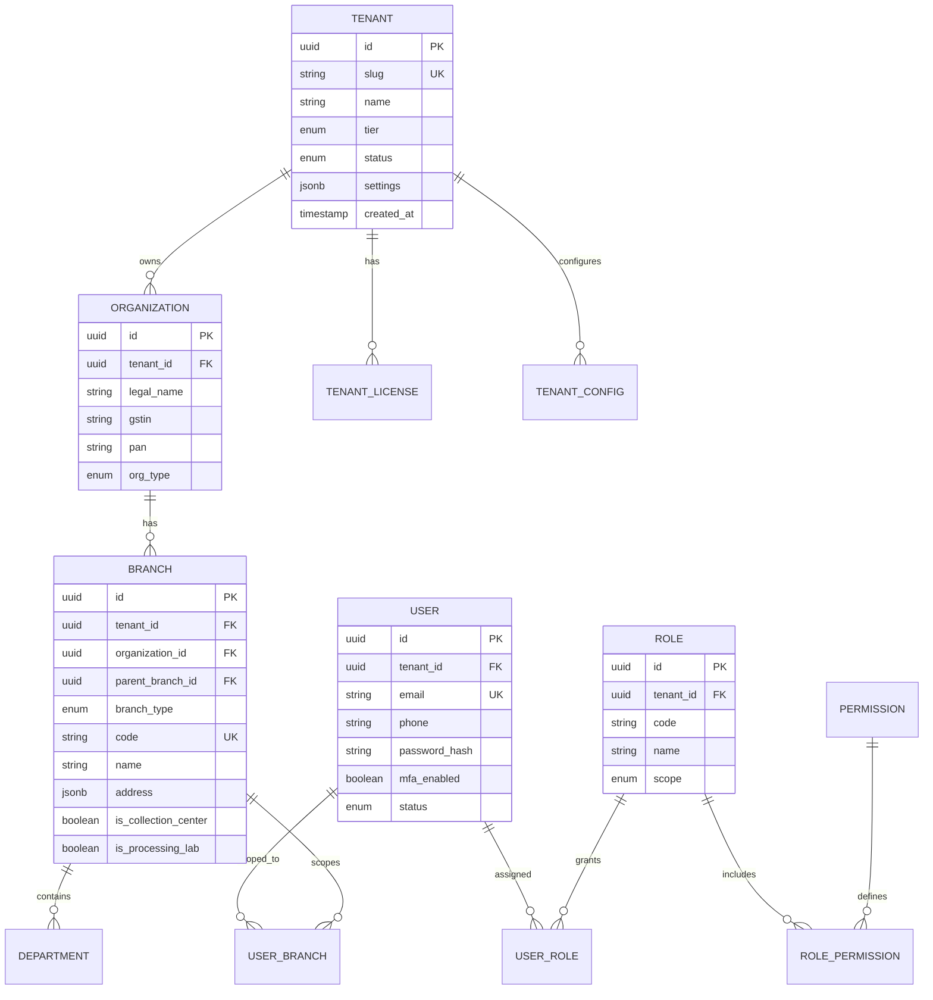
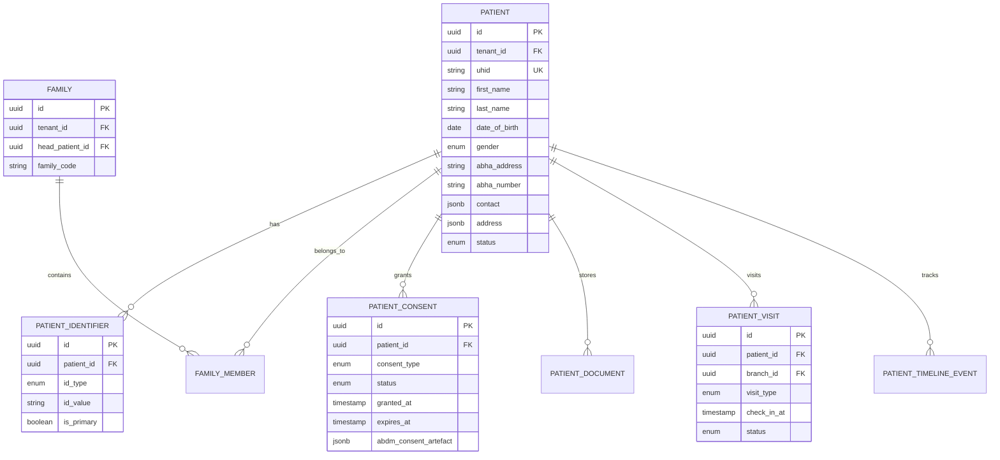
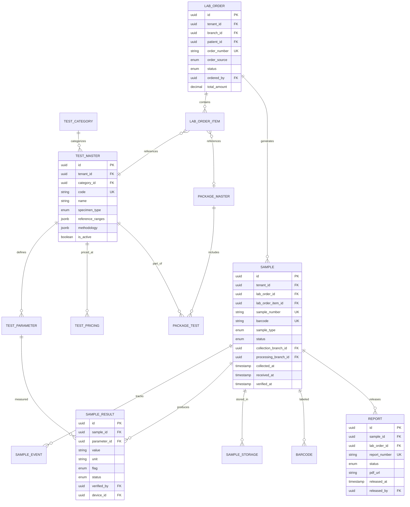
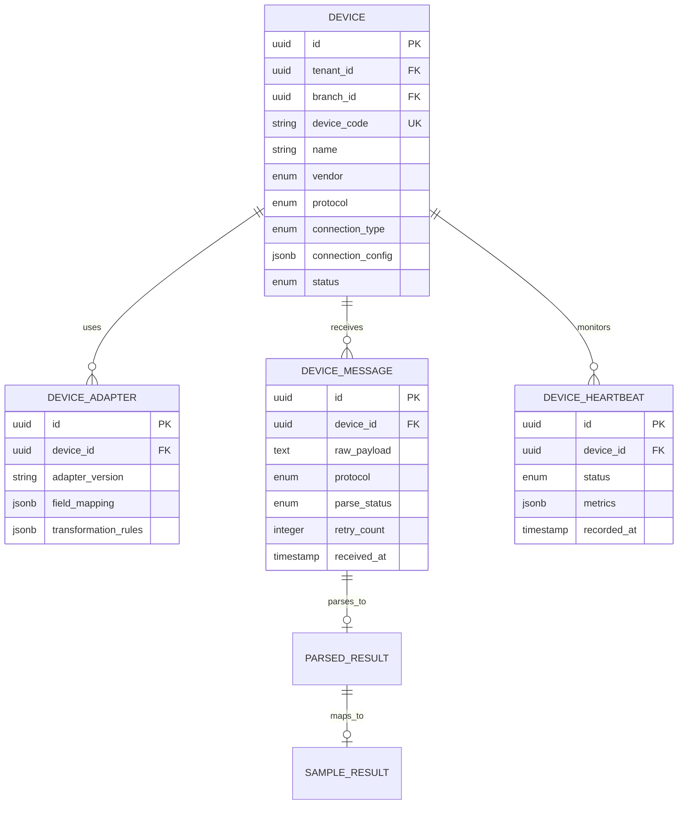
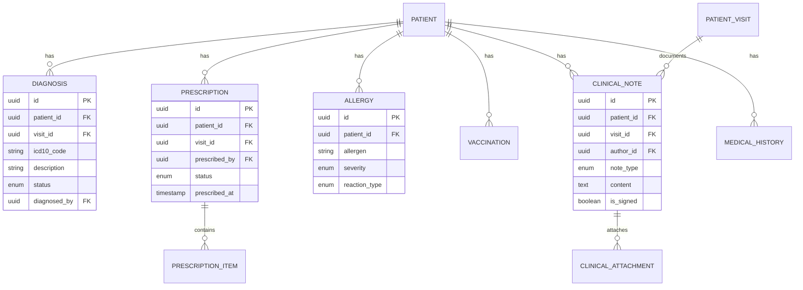
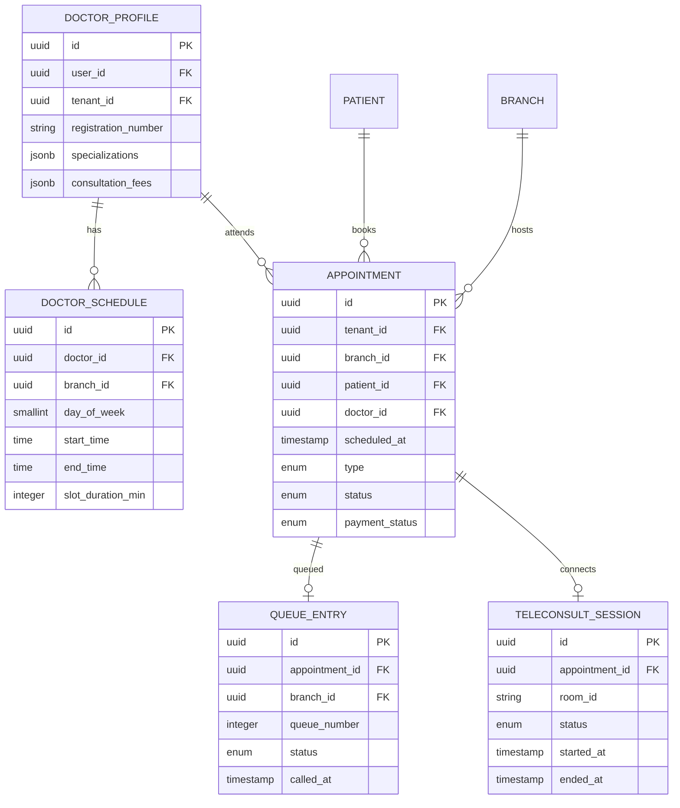
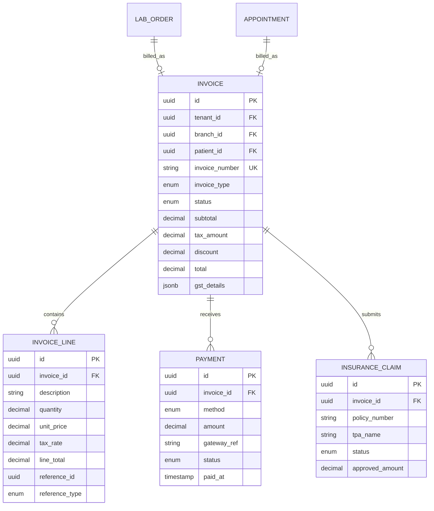
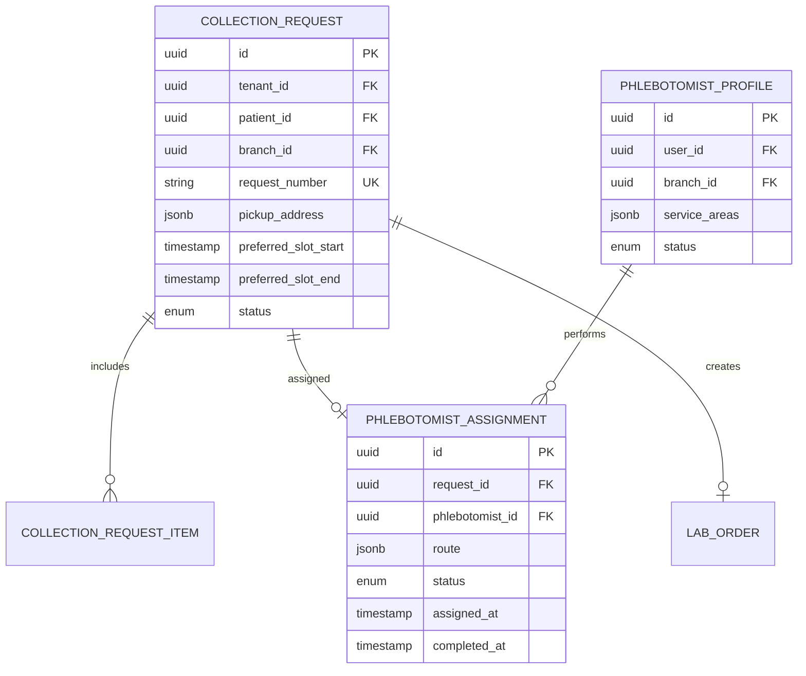
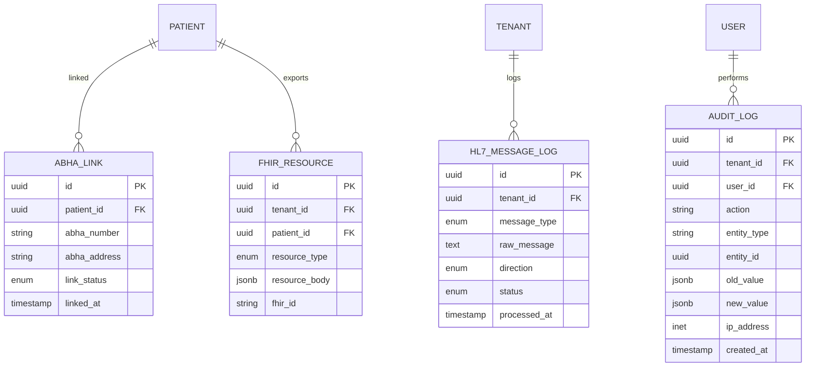
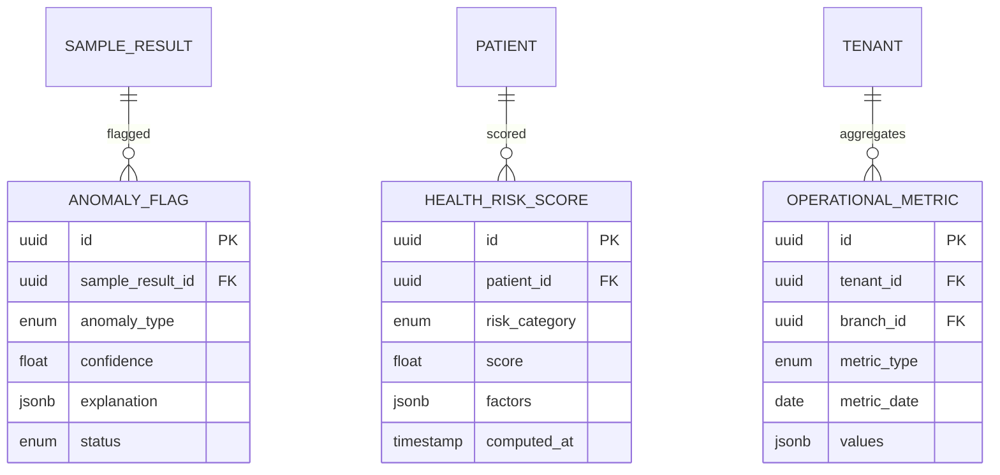

# 02 — Entity-Relationship Diagram

## 1. ER Overview

The data model is organized around **Tenant → Organization → Branch** hierarchy with **Patient** and **User** as cross-cutting entities. LIMS, EHR, PMS, and Billing share the patient identity via `patient_id` / `uhid`.

---

## 2. Core Identity & Tenancy ER

---

## 3. Patient Domain ER

---

## 4. LIMS Domain ER

---

## 5. Device Integration ER

---

## 6. EHR Domain ER

---

## 7. PMS Domain ER

---

## 8. Billing Domain ER

---

## 9. Home Collection ER

---

## 10. Integration & Compliance ER

---

## 11. AI Analytics ER

---

## 12. Key Relationships Summary

| From | To | Cardinality | Description |
|------|-----|-------------|-------------|
| Tenant | Organization | 1:N | SaaS tenant owns orgs |
| Organization | Branch | 1:N | Multi-branch hierarchy |
| Branch | Branch | 1:N | Parent/child (franchise tree) |
| Patient | LabOrder | 1:N | Patient orders tests |
| LabOrder | Sample | 1:N | Order generates samples |
| Sample | SampleResult | 1:N | Sample produces results |
| Sample | Report | 1:1 | Verified sample → report |
| Device | DeviceMessage | 1:N | Raw instrument data |
| DeviceMessage | SampleResult | 1:1 | Parsed → validated result |
| Patient | Appointment | 1:N | PMS scheduling |
| LabOrder | Invoice | 1:1 | Billing linkage |
| CollectionRequest | LabOrder | 1:1 | Home collection → lab order |

---

## 13. Indexing Strategy (Summary)

- All tables: `(tenant_id)` B-tree index
- Patient: `(tenant_id, uhid)` unique
- Sample: `(tenant_id, barcode)`, `(tenant_id, status, created_at)`
- LabOrder: `(tenant_id, order_number)`, `(patient_id, created_at DESC)`
- AuditLog: `(tenant_id, created_at DESC)` — partitioned monthly
- Full-text: Patient name, Test name → Elasticsearch
