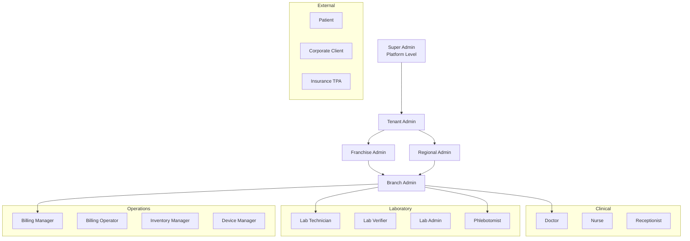

# 04 — User Roles & Permissions Matrix

## 1. Role Hierarchy



---

## 2. System Roles (40 Roles)

| # | Role Code | Display Name | Scope | MFA Required |
|---|-----------|--------------|-------|--------------|
| 1 | `super_admin` | Super Admin | Platform | Yes |
| 2 | `tenant_admin` | Tenant Administrator | Tenant | Yes |
| 3 | `franchise_admin` | Franchise Administrator | Franchise tree | Yes |
| 4 | `regional_admin` | Regional Administrator | Region | Yes |
| 5 | `branch_admin` | Branch Administrator | Branch | Yes |
| 6 | `lab_admin` | Laboratory Administrator | Lab branch | Yes |
| 7 | `lab_manager` | Lab Manager | Lab branch | Yes |
| 8 | `lab_technician` | Lab Technician | Branch | No |
| 9 | `lab_verifier` | Result Verifier | Branch | No |
| 10 | `lab_approver` | Report Approver | Branch | Yes |
| 11 | `pathologist` | Pathologist | Branch | Yes |
| 12 | `phlebotomist` | Phlebotomist | Branch | No |
| 13 | `sample_collector` | Sample Collector | Branch | No |
| 14 | `front_desk` | Front Desk / Reception | Branch | No |
| 15 | `order_entry` | Order Entry Operator | Branch | No |
| 16 | `doctor` | Doctor / Consultant | Branch | No |
| 17 | `nurse` | Nurse | Branch | No |
| 18 | `billing_manager` | Billing Manager | Branch/Tenant | Yes |
| 19 | `billing_operator` | Billing Operator | Branch | No |
| 20 | `accountant` | Accountant | Tenant | Yes |
| 21 | `inventory_manager` | Inventory Manager | Branch | No |
| 22 | `device_manager` | Device Manager | Branch | No |
| 23 | `device_operator` | Device Operator | Branch | No |
| 24 | `home_collection_manager` | Home Collection Manager | Tenant | No |
| 25 | `home_collection_dispatcher` | Collection Dispatcher | Branch | No |
| 26 | `corporate_client` | Corporate Client Portal | Corporate | No |
| 27 | `insurance_tpa` | Insurance TPA | External | Yes |
| 28 | `patient` | Patient (Mobile App) | Self | Optional |
| 29 | `report_viewer` | Report Viewer (Read-only) | Branch | No |
| 30 | `audit_viewer` | Audit Log Viewer | Tenant | Yes |
| 31 | `compliance_officer` | Compliance Officer | Tenant | Yes |
| 32 | `data_analyst` | Data Analyst | Tenant | No |
| 33 | `ai_reviewer` | AI Insight Reviewer | Tenant | No |
| 34 | `integration_admin` | Integration Admin (ABDM/FHIR) | Tenant | Yes |
| 35 | `marketing_manager` | Marketing Manager | Tenant | No |
| 36 | `support_agent` | Support Agent | Platform/Tenant | No |
| 37 | `radiologist` | Radiologist (RIS/PACS) | Branch | Yes |
| 38 | `teleconsult_doctor` | Teleconsultation Doctor | Branch | No |
| 39 | `franchise_owner` | Franchise Owner | Franchise | Yes |
| 40 | `read_only_executive` | Executive Dashboard (Read-only) | Tenant | No |

---

## 3. Permission Modules

Permissions follow the pattern: `{module}.{resource}.{action}`

| Module | Resources | Actions |
|--------|-----------|---------|
| `patient` | patient, family, consent, document, visit, timeline | create, read, update, delete, export |
| `lims` | test_master, package, order, sample, result, report | create, read, update, delete, verify, approve, release, reject |
| `device` | device, adapter, message, monitor | create, read, update, delete, configure, retry |
| `ehr` | diagnosis, prescription, allergy, vaccination, note | create, read, update, delete, sign |
| `pms` | schedule, appointment, queue, teleconsult | create, read, update, delete, cancel |
| `billing` | invoice, payment, claim, refund, gst | create, read, update, delete, void, reconcile |
| `collection` | request, assignment, route | create, read, update, delete, dispatch |
| `admin` | user, role, branch, franchise, config | create, read, update, delete, impersonate |
| `integration` | abdm, fhir, hl7 | read, send, configure |
| `analytics` | dashboard, insight, export | read, configure |
| `audit` | log | read, export |

---

## 4. Permissions Matrix (Key Roles × Key Actions)

Legend: ✅ Full | 👁 Read | ⚡ Limited (own branch) | ❌ None

### Patient Management

| Permission | Tenant Admin | Branch Admin | Front Desk | Doctor | Patient |
|------------|:---:|:---:|:---:|:---:|:---:|
| patient.create | ✅ | ✅ | ✅ | ⚡ | ❌ |
| patient.read | ✅ | ⚡ | ⚡ | ⚡ | 👁 self |
| patient.update | ✅ | ⚡ | ⚡ | ⚡ | 👁 self |
| patient.delete | ✅ | ❌ | ❌ | ❌ | ❌ |
| patient.export | ✅ | ⚡ | ❌ | ❌ | ❌ |
| consent.manage | ✅ | ⚡ | ✅ | ⚡ | 👁 self |

### LIMS

| Permission | Lab Admin | Lab Tech | Verifier | Approver | Pathologist |
|------------|:---:|:---:|:---:|:---:|:---:|
| test_master.manage | ✅ | 👁 | 👁 | 👁 | 👁 |
| order.create | ✅ | ❌ | ❌ | ❌ | ❌ |
| sample.collect | ✅ | ✅ | ❌ | ❌ | ❌ |
| sample.process | ✅ | ✅ | ❌ | ❌ | ❌ |
| result.enter | ✅ | ✅ | ❌ | ❌ | ❌ |
| result.verify | ✅ | ❌ | ✅ | ❌ | ✅ |
| result.approve | ✅ | ❌ | ❌ | ✅ | ✅ |
| report.release | ✅ | ❌ | ❌ | ✅ | ✅ |
| sample.reject | ✅ | ✅ | ✅ | ✅ | ✅ |

### Billing

| Permission | Billing Mgr | Billing Op | Accountant | Front Desk | Corporate |
|------------|:---:|:---:|:---:|:---:|:---:|
| invoice.create | ✅ | ✅ | 👁 | ✅ | ❌ |
| invoice.void | ✅ | ❌ | ✅ | ❌ | ❌ |
| payment.collect | ✅ | ✅ | 👁 | ✅ | ❌ |
| refund.process | ✅ | ❌ | ✅ | ❌ | ❌ |
| claim.submit | ✅ | ✅ | ✅ | ❌ | ⚡ |
| gst.report | ✅ | ❌ | ✅ | ❌ | ❌ |

### Admin & Compliance

| Permission | Super Admin | Tenant Admin | Compliance | Audit Viewer |
|------------|:---:|:---:|:---:|:---:|
| user.manage | ✅ | ✅ | ❌ | ❌ |
| role.manage | ✅ | ✅ | ❌ | ❌ |
| branch.manage | ✅ | ✅ | ❌ | ❌ |
| franchise.manage | ✅ | ✅ | ❌ | ❌ |
| audit.read | ✅ | ✅ | ✅ | ✅ |
| integration.configure | ✅ | ✅ | ⚡ | ❌ |
| tenant.settings | ✅ | ✅ | ❌ | ❌ |

---

## 5. Branch-Scoped Access Control (ABAC)

Beyond RBAC, these attributes constrain access:

| Attribute | Rule |
|-----------|------|
| `tenant_id` | User can only access data within their tenant |
| `branch_id` | Branch-scoped roles limited to assigned branches |
| `franchise_tree` | Franchise admin sees all branches under franchise root |
| `patient_ownership` | Patient role sees only own records + linked family |
| `doctor_patients` | Doctor sees patients with appointments or referrals |
| `time_window` | Audit exports limited to compliance officer + date range |
| `report_release` | Requires MFA + dual approval for critical results |

---

## 6. Default Role Bundles by Portal

| Portal | Default Roles |
|--------|---------------|
| Admin Portal | tenant_admin, branch_admin, lab_admin, billing_manager, compliance_officer |
| Doctor Portal | doctor, teleconsult_doctor, pathologist |
| Lab Workstation | lab_technician, lab_verifier, lab_approver, device_operator |
| Patient App | patient |
| Franchise Dashboard | franchise_admin, franchise_owner, regional_admin |
| Corporate Portal | corporate_client |
| Device Gateway | device_manager, device_operator (service account) |

---

## 7. MFA Policy Matrix

| Action | MFA Required | Method |
|--------|:---:|--------|
| Login (admin roles) | Yes | TOTP / WebAuthn |
| Report release (critical) | Yes | TOTP |
| Bulk patient export | Yes | TOTP |
| Billing void/refund > ₹10K | Yes | TOTP |
| Integration config change | Yes | TOTP |
| User impersonation | Yes | TOTP + audit |
| Password change | Yes | Email OTP + TOTP |
| Patient login | Optional | SMS OTP |

---

## 8. System Permissions Seed (Sample)

```sql
INSERT INTO core.permissions (code, module, action, description) VALUES
('patient.patient.create', 'patient', 'create', 'Register new patient'),
('patient.patient.read', 'patient', 'read', 'View patient records'),
('lims.sample.verify', 'lims', 'verify', 'Verify sample results'),
('lims.report.release', 'lims', 'release', 'Release report to patient'),
('billing.invoice.void', 'billing', 'void', 'Void an invoice'),
('admin.user.manage', 'admin', 'manage', 'Create/update users'),
('audit.log.read', 'audit', 'read', 'View audit logs'),
('integration.abdm.configure', 'integration', 'configure', 'Configure ABDM integration');
-- ... 200+ permissions total
```

---

## 9. JWT Claims Structure

```json
{
  "sub": "user-uuid",
  "tenant_id": "tenant-uuid",
  "email": "user@lab.com",
  "roles": ["lab_verifier"],
  "permissions": ["lims.result.verify", "lims.sample.read"],
  "branch_ids": ["branch-uuid-1", "branch-uuid-2"],
  "franchise_root_id": "franchise-uuid",
  "mfa_verified": true,
  "session_id": "session-uuid",
  "iat": 1717800000,
  "exp": 1717800900
}
```

---

## 10. Approval Requirements

Phase 1 approval needed for:
- [ ] Role count and naming conventions
- [ ] Permission granularity level
- [ ] MFA enforcement policies
- [ ] Branch vs tenant scope rules
