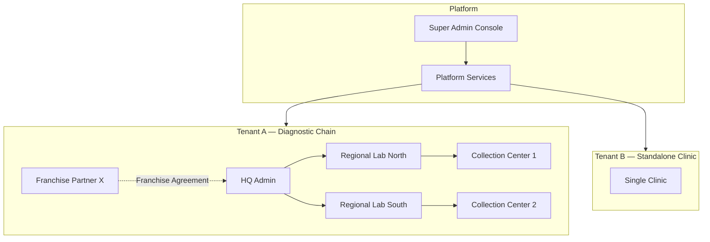
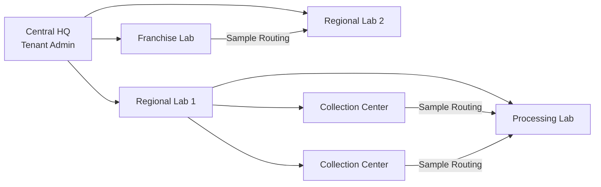
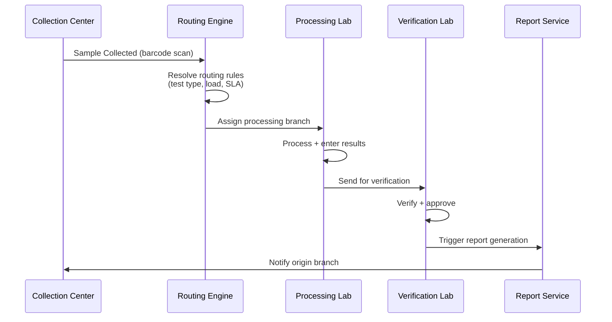
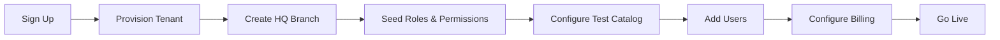

# 05 — Multi-Tenant Architecture

## 1. Tenancy Model

HealthEcosystem uses a **Shared Database, Shared Schema** model with **Row-Level Security (RLS)** and `tenant_id` on every domain table. This balances cost efficiency with strong isolation for healthcare compliance.



---

## 2. Tenant Hierarchy Levels

| Level | Entity | Description | Example |
|-------|--------|-------------|---------|
| L0 | Platform | SaaS operator | HealthEcosystem Ops |
| L1 | Tenant | Paying customer / diagnostic chain | Apollo Diagnostics |
| L2 | Organization | Legal entity within tenant | Apollo Labs Pvt Ltd |
| L3 | Branch | Physical or logical location | Andheri Collection Center |
| L4 | Department | Sub-unit within branch | Hematology, Biochemistry |
| L5 | Franchise | Partner-operated branch under agreement | Franchise Lab — Pune |

---

## 3. Franchise & Multi-Branch Model



### Branch Types & Capabilities

| Branch Type | Can Collect | Can Process | Can Verify | Can Bill | Can Release Reports |
|-------------|:-----------:|:-----------:|:----------:|:--------:|:-------------------:|
| HQ | — | — | — | ✅ | — |
| Regional Lab | ✅ | ✅ | ✅ | ✅ | ✅ |
| Processing Lab | ❌ | ✅ | ✅ | ❌ | ❌ |
| Collection Center | ✅ | ❌ | ❌ | ✅ | ❌ |
| Franchise | ✅ | ⚡ | ⚡ | ✅ | ⚡ |
| Clinic | ✅ | ❌ | ❌ | ✅ | ❌ |

⚡ = Configurable per franchise agreement

---

## 4. Tenant Isolation Strategy

### 4.1 Database Layer

```sql
-- Every request sets tenant context
SET LOCAL app.current_tenant = '550e8400-e29b-41d4-a716-446655440000';
SET LOCAL app.current_branch = '660e8400-e29b-41d4-a716-446655440001';

-- RLS policy enforces isolation
CREATE POLICY tenant_isolation ON lims.samples
    USING (tenant_id = current_setting('app.current_tenant')::UUID);
```

### 4.2 Application Layer

| Layer | Isolation Mechanism |
|-------|---------------------|
| API Gateway | Extract `tenant_id` from JWT / subdomain |
| NestJS Guards | `TenantGuard` validates tenant + branch access |
| Repository | Auto-inject `tenant_id` in all queries |
| Cache (Redis) | Key prefix: `tenant:{id}:...` |
| Elasticsearch | Index alias per tenant: `patients-{tenant_slug}` |
| S3 | Bucket prefix: `s3://health-docs/{tenant_id}/...` |
| Message Queue | Topic/tag filtering by tenant_id |

### 4.3 Subdomain Routing

```
https://apollo.healthplatform.com     → Tenant: apollo
https://srl.healthplatform.com        → Tenant: srl
https://app.healthplatform.com        → Patient app (tenant from login)
https://admin.healthplatform.com      → Platform super admin
```

---

## 5. Franchise Agreement Model

```sql
CREATE TABLE core.franchise_agreements (
    id                  UUID PRIMARY KEY,
    tenant_id           UUID NOT NULL,
    franchise_branch_id UUID NOT NULL REFERENCES core.branches(id),
    parent_branch_id    UUID NOT NULL REFERENCES core.branches(id),
    agreement_number    VARCHAR(32) NOT NULL,
    revenue_share_pct   DECIMAL(5,2),
    can_set_pricing     BOOLEAN DEFAULT FALSE,
    can_process_local   BOOLEAN DEFAULT FALSE,
    can_release_reports BOOLEAN DEFAULT FALSE,
    branding_config     JSONB DEFAULT '{}',
    effective_from      DATE NOT NULL,
    effective_to        DATE,
    status              VARCHAR(32) DEFAULT 'active'
);
```

### Franchise Data Visibility

| Data Type | HQ Visibility | Franchise Visibility |
|-----------|:-------------:|:--------------------:|
| Own branch orders | ✅ | ✅ |
| Other franchise orders | ✅ | ❌ |
| Consolidated revenue | ✅ | 👁 own only |
| Test master catalog | ✅ | 👁 read-only |
| Patient data (own branch) | ✅ | ✅ |
| Patient data (other branches) | ⚡ consent-based | ❌ |
| Device configs | ✅ | ⚡ own devices |

---

## 6. Sample Routing Across Branches



### Routing Rules Engine

```json
{
  "rules": [
    {
      "priority": 1,
      "condition": { "test_category": "histopathology" },
      "route_to": "branch:central-pathology-lab"
    },
    {
      "priority": 2,
      "condition": { "branch_type": "franchise" },
      "route_to": "branch:nearest-regional-lab"
    },
    {
      "priority": 99,
      "condition": { "default": true },
      "route_to": "branch:own-processing-lab"
    }
  ]
}
```

---

## 7. Tenant Tiers & Feature Flags

| Feature | Starter | Professional | Enterprise | Franchise |
|---------|:-------:|:------------:|:----------:|:---------:|
| Max Branches | 1 | 10 | Unlimited | Unlimited |
| Max Users | 10 | 100 | Unlimited | Unlimited |
| LIMS | ✅ | ✅ | ✅ | ✅ |
| EHR | ❌ | ✅ | ✅ | ✅ |
| PMS | ❌ | ✅ | ✅ | ✅ |
| Device Integration | ❌ | ✅ | ✅ | ✅ |
| Home Collection | ❌ | ✅ | ✅ | ✅ |
| AI Analytics | ❌ | ❌ | ✅ | ✅ |
| ABDM Integration | ❌ | ✅ | ✅ | ✅ |
| Custom Branding | ❌ | ❌ | ✅ | ✅ |
| Franchise Management | ❌ | ❌ | ❌ | ✅ |
| SLA | 99.5% | 99.9% | 99.95% | 99.95% |

Feature flags stored in `core.tenants.settings`:

```json
{
  "features": {
    "ehr": true,
    "ai_analytics": true,
    "abdm": true,
    "franchise_mode": true
  },
  "limits": {
    "max_branches": 500,
    "max_users": 5000,
    "storage_gb": 1000
  }
}
```

---

## 8. Data Residency & Compliance

| Regulation | Implementation |
|------------|----------------|
| DPDP (India) | Data stored in ap-south-1; consent management; data principal rights API |
| HIPAA (US) | BAA-ready; encryption; audit trails; minimum necessary access |
| GDPR (EU) | Right to erasure workflow; data portability export; DPO contact |
| ISO 27001 | ISMS controls mapped to platform features |

### Data Residency per Tenant

```sql
ALTER TABLE core.tenants ADD COLUMN data_region VARCHAR(32) DEFAULT 'ap-south-1';
-- Supported: ap-south-1, ap-southeast-1, eu-west-1, us-east-1
```

Cross-region replication for DR only; primary read/write in tenant's region.

---

## 9. Tenant Onboarding Flow



Automated provisioning via `TenantProvisioningService`:
1. Create tenant record + subdomain
2. Create default organization + HQ branch
3. Seed roles, permissions, test categories
4. Create tenant admin user
5. Configure S3 prefix, ES index, Redis namespace
6. Send welcome email with setup wizard link

---

## 10. Cross-Tenant Security Boundaries

| Threat | Mitigation |
|--------|------------|
| Tenant ID injection | JWT-signed tenant_id; server-side validation |
| Cross-tenant query | RLS + repository tenant filter (defense in depth) |
| Cache leakage | Tenant-prefixed Redis keys; TTL on all cached data |
| File access | S3 pre-signed URLs scoped to tenant prefix |
| WebSocket rooms | Room names include tenant_id; auth on subscribe |
| Search leakage | ES queries always filter by tenant_id |
| Audit cross-access | Audit logs tenant-scoped; super admin requires impersonation audit |

---

## 11. Approval Checklist

- [ ] Shared schema + RLS approach approved
- [ ] Franchise revenue share model acceptable
- [ ] Branch routing rules engine design approved
- [ ] Tenant tier feature matrix approved
- [ ] Data residency regions confirmed
