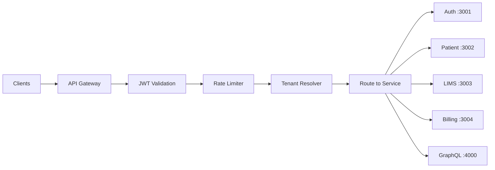

# 06 — API Architecture

## 1. API Strategy Overview

| Protocol | Use Case | Base Path |
|----------|----------|-----------|
| REST | CRUD operations, mobile apps, third-party integrations | `/api/v1/` |
| GraphQL | Admin dashboards, complex queries, real-time subscriptions | `/graphql` |
| WebSocket | Live sample tracking, queue updates, device status, teleconsult | `/ws` |
| FHIR R4 | Healthcare interoperability (ABDM, external EHR) | `/fhir/r4/` |
| HL7 v2 | Legacy lab/hospital integrations (MLLP) | Device gateway (TCP) |

---

## 2. API Gateway Architecture



### Gateway Responsibilities

- TLS termination
- JWT validation & refresh
- Rate limiting (100 req/min default, configurable per tier)
- Tenant resolution (subdomain / header / JWT)
- Request ID injection (`X-Request-ID`)
- CORS policy
- API versioning (`/api/v1/`, `/api/v2/`)
- Response compression

---

## 3. REST API Endpoints (Core Modules)

### 3.1 Authentication

```
POST   /api/v1/auth/login
POST   /api/v1/auth/logout
POST   /api/v1/auth/refresh
POST   /api/v1/auth/mfa/verify
POST   /api/v1/auth/mfa/setup
POST   /api/v1/auth/password/forgot
POST   /api/v1/auth/password/reset
POST   /api/v1/auth/oauth/{provider}/callback
GET    /api/v1/auth/me
```

### 3.2 Patient Management

```
POST   /api/v1/patients                          # Register patient
GET    /api/v1/patients                          # List/search patients
GET    /api/v1/patients/:id                      # Get patient detail
PATCH  /api/v1/patients/:id                      # Update patient
GET    /api/v1/patients/:id/timeline             # Patient timeline
GET    /api/v1/patients/:id/visits               # Visit history
POST   /api/v1/patients/:id/documents            # Upload document
GET    /api/v1/patients/:id/documents            # List documents
POST   /api/v1/patients/:id/consents             # Record consent
GET    /api/v1/patients/search?q=               # Elasticsearch search
POST   /api/v1/patients/:id/family               # Link family member
```

### 3.3 LIMS

```
# Test Master
GET    /api/v1/lims/tests                        # List tests
POST   /api/v1/lims/tests                        # Create test
GET    /api/v1/lims/tests/:id                    # Get test detail
PATCH  /api/v1/lims/tests/:id                    # Update test
GET    /api/v1/lims/packages                     # List packages
POST   /api/v1/lims/packages                     # Create package
GET    /api/v1/lims/pricing?branch_id=           # Get pricing

# Orders
POST   /api/v1/lims/orders                       # Create order
GET    /api/v1/lims/orders                       # List orders
GET    /api/v1/lims/orders/:id                   # Order detail
PATCH  /api/v1/lims/orders/:id/cancel            # Cancel order

# Samples
GET    /api/v1/lims/samples                      # List samples
GET    /api/v1/lims/samples/:id                  # Sample detail
GET    /api/v1/lims/samples/barcode/:barcode     # Lookup by barcode
PATCH  /api/v1/lims/samples/:id/collect          # Mark collected
PATCH  /api/v1/lims/samples/:id/receive          # Mark received
PATCH  /api/v1/lims/samples/:id/process          # Mark processing
PATCH  /api/v1/lims/samples/:id/reject           # Reject sample
GET    /api/v1/lims/samples/:id/events           # Sample event log

# Results
POST   /api/v1/lims/samples/:id/results          # Enter results
PATCH  /api/v1/lims/results/:id/verify           # Verify result
PATCH  /api/v1/lims/results/:id/approve          # Approve result
GET    /api/v1/lims/results/pending                # Pending verification queue

# Reports
GET    /api/v1/lims/reports                      # List reports
GET    /api/v1/lims/reports/:id                  # Report detail
POST   /api/v1/lims/reports/:id/release          # Release report
GET    /api/v1/lims/reports/:id/download           # Download PDF
```

### 3.4 Device Integration

```
GET    /api/v1/devices                           # List devices
POST   /api/v1/devices                           # Register device
GET    /api/v1/devices/:id                       # Device detail
PATCH  /api/v1/devices/:id                       # Update config
GET    /api/v1/devices/:id/status                # Live status
GET    /api/v1/devices/:id/messages              # Message log
POST   /api/v1/devices/:id/messages/:msgId/retry # Retry failed message
GET    /api/v1/devices/:id/heartbeats            # Heartbeat history
```

### 3.5 EHR

```
GET    /api/v1/ehr/patients/:id/diagnoses
POST   /api/v1/ehr/patients/:id/diagnoses
GET    /api/v1/ehr/patients/:id/prescriptions
POST   /api/v1/ehr/patients/:id/prescriptions
GET    /api/v1/ehr/patients/:id/allergies
POST   /api/v1/ehr/patients/:id/allergies
GET    /api/v1/ehr/patients/:id/clinical-notes
POST   /api/v1/ehr/patients/:id/clinical-notes
POST   /api/v1/ehr/clinical-notes/:id/sign
```

### 3.6 PMS

```
GET    /api/v1/pms/doctors/:id/schedule
POST   /api/v1/pms/doctors/:id/schedule
GET    /api/v1/pms/appointments
POST   /api/v1/pms/appointments
PATCH  /api/v1/pms/appointments/:id/cancel
GET    /api/v1/pms/queue?branch_id=
POST   /api/v1/pms/queue/:id/call
POST   /api/v1/pms/teleconsult/:id/start
POST   /api/v1/pms/teleconsult/:id/end
```

### 3.7 Billing

```
POST   /api/v1/billing/invoices
GET    /api/v1/billing/invoices
GET    /api/v1/billing/invoices/:id
POST   /api/v1/billing/invoices/:id/payments
POST   /api/v1/billing/invoices/:id/void
POST   /api/v1/billing/claims
GET    /api/v1/billing/gst-report?period=
```

### 3.8 Home Collection

```
POST   /api/v1/collection/requests
GET    /api/v1/collection/requests
PATCH  /api/v1/collection/requests/:id/assign
PATCH  /api/v1/collection/requests/:id/complete
GET    /api/v1/collection/phlebotomists/:id/route
```

### 3.9 Admin

```
GET    /api/v1/admin/users
POST   /api/v1/admin/users
GET    /api/v1/admin/branches
POST   /api/v1/admin/branches
GET    /api/v1/admin/franchises
GET    /api/v1/admin/audit-logs
GET    /api/v1/admin/dashboard/metrics
```

---

## 4. GraphQL Schema (Key Types)

```graphql
type Query {
  patient(id: ID!): Patient
  patients(filter: PatientFilter, pagination: Pagination): PatientConnection
  labOrder(id: ID!): LabOrder
  labOrders(filter: OrderFilter, pagination: Pagination): OrderConnection
  sample(id: ID!): Sample
  samples(filter: SampleFilter, pagination: Pagination): SampleConnection
  dashboardMetrics(branchId: ID, dateRange: DateRange): DashboardMetrics
  pendingVerifications(branchId: ID): [SampleResult]
  deviceStatuses(branchId: ID): [DeviceStatus]
}

type Mutation {
  createPatient(input: CreatePatientInput!): Patient
  createLabOrder(input: CreateLabOrderInput!): LabOrder
  verifyResult(id: ID!, input: VerifyResultInput!): SampleResult
  releaseReport(id: ID!): Report
  createAppointment(input: CreateAppointmentInput!): Appointment
}

type Subscription {
  sampleStatusChanged(branchId: ID!): Sample
  queueUpdated(branchId: ID!): QueueEntry
  deviceStatusChanged(branchId: ID!): DeviceStatus
  reportReleased(patientId: ID!): Report
}
```

---

## 5. WebSocket Events

| Event | Direction | Payload | Use Case |
|-------|-----------|---------|----------|
| `sample:status` | Server → Client | `{ sampleId, status, branchId }` | Lab workstation live board |
| `queue:updated` | Server → Client | `{ branchId, entries[] }` | Reception queue display |
| `device:heartbeat` | Server → Client | `{ deviceId, status, metrics }` | Device monitoring dashboard |
| `report:released` | Server → Client | `{ reportId, patientId }` | Patient app notification |
| `appointment:called` | Server → Client | `{ appointmentId, queueNumber }` | Patient waiting area |
| `teleconsult:signal` | Bidirectional | WebRTC signaling | Teleconsultation |

### WebSocket Authentication

```
ws://api.healthplatform.com/ws?token=<jwt>&branch_id=<uuid>
```

---

## 6. FHIR R4 Endpoints (ABDM Compatible)

```
GET    /fhir/r4/metadata                         # CapabilityStatement
GET    /fhir/r4/Patient/:id
POST   /fhir/r4/Patient
GET    /fhir/r4/Observation?patient=:id
POST   /fhir/r4/Observation
GET    /fhir/r4/DiagnosticReport?patient=:id
POST   /fhir/r4/DiagnosticReport
GET    /fhir/r4/Bundle                           # Search results
POST   /fhir/r4/Bundle                           # Transaction bundle
```

---

## 7. Standard Response Format

### Success

```json
{
  "success": true,
  "data": { ... },
  "meta": {
    "request_id": "req-uuid",
    "timestamp": "2026-06-08T10:30:00Z"
  }
}
```

### Paginated List

```json
{
  "success": true,
  "data": [ ... ],
  "meta": {
    "pagination": {
      "page": 1,
      "limit": 20,
      "total": 1543,
      "total_pages": 78
    },
    "request_id": "req-uuid"
  }
}
```

### Error

```json
{
  "success": false,
  "error": {
    "code": "SAMPLE_NOT_FOUND",
    "message": "Sample with barcode BC-20260608-0042 not found",
    "details": [],
    "request_id": "req-uuid"
  }
}
```

### HTTP Status Codes

| Code | Usage |
|------|-------|
| 200 | Success |
| 201 | Created |
| 204 | Deleted (no content) |
| 400 | Validation error |
| 401 | Unauthorized |
| 403 | Forbidden (RBAC) |
| 404 | Not found |
| 409 | Conflict (duplicate) |
| 422 | Business rule violation |
| 429 | Rate limited |
| 500 | Internal error |

---

## 8. API Versioning & Deprecation

- URL-based versioning: `/api/v1/`, `/api/v2/`
- Deprecation header: `Sunset: Sat, 01 Jan 2028 00:00:00 GMT`
- Minimum 12-month deprecation window
- Breaking changes only in major versions

---

## 9. Rate Limiting

| Tier | REST (req/min) | GraphQL (req/min) | WebSocket (connections) |
|------|:--------------:|:-----------------:|:-----------------------:|
| Starter | 60 | 30 | 10 |
| Professional | 300 | 120 | 50 |
| Enterprise | 1000 | 500 | 200 |
| Device Gateway | 10000 | — | 500 |

Headers: `X-RateLimit-Limit`, `X-RateLimit-Remaining`, `X-RateLimit-Reset`

---

## 10. Approval Checklist

- [ ] REST endpoint naming conventions approved
- [ ] GraphQL vs REST boundary decisions approved
- [ ] WebSocket event catalog approved
- [ ] FHIR endpoint scope approved
- [ ] Response format standards approved
