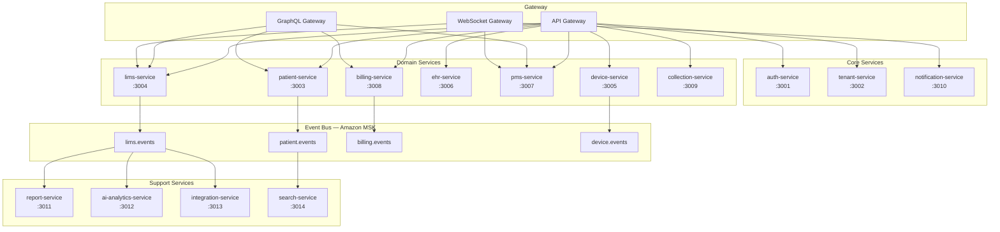
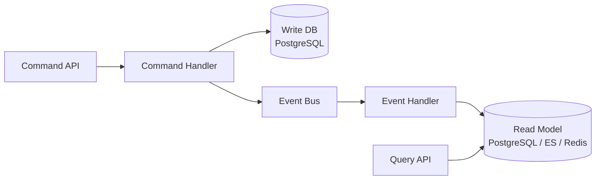

# 07 — Microservices Architecture

## 1. Service Map



---

## 2. Service Specifications

### 2.1 auth-service

| Attribute | Detail |
|-----------|--------|
| Port | 3001 |
| Database | `core.users`, `core.roles`, sessions in Redis |
| Responsibilities | Login, JWT, MFA, OAuth, password reset, session management |
| Events Published | `user.logged_in`, `user.mfa_enabled`, `user.locked` |
| Dependencies | Redis, PostgreSQL |

### 2.2 tenant-service

| Attribute | Detail |
|-----------|--------|
| Port | 3002 |
| Database | `core.tenants`, `core.organizations`, `core.branches`, franchise agreements |
| Responsibilities | Tenant provisioning, branch CRUD, franchise management, feature flags |
| Events Published | `tenant.created`, `branch.created`, `franchise.activated` |
| Dependencies | PostgreSQL, S3 (tenant assets) |

### 2.3 patient-service

| Attribute | Detail |
|-----------|--------|
| Port | 3003 |
| Database | `patient.*` schema |
| Responsibilities | Registration, UHID, family, consent, documents, visits, timeline |
| CQRS | Write: RegisterPatient, UpdatePatient; Read: GetPatient, SearchPatients |
| Events Published | `patient.registered`, `patient.updated`, `consent.granted` |
| Events Consumed | `lims.report_released` → timeline event |
| Dependencies | PostgreSQL, Elasticsearch, S3 |

### 2.4 lims-service (Core)

| Attribute | Detail |
|-----------|--------|
| Port | 3004 |
| Database | `lims.*` schema |
| Responsibilities | Test master, orders, samples, results, sample routing, verification |
| CQRS | Heavy — separate read models for dashboards |
| Events Published | `order.created`, `sample.collected`, `result.verified`, `report.released` |
| Events Consumed | `device.result_parsed`, `collection.completed` |
| Dependencies | PostgreSQL, Redis (sample status cache), WebSocket |

### 2.5 device-service

| Attribute | Detail |
|-----------|--------|
| Port | 3005 |
| Database | `device.*` schema |
| Responsibilities | Device registry, ASTM/HL7 parsing, adapter management, retry queues |
| Pattern | Message-driven; isolated network namespace in K8s |
| Events Published | `device.result_parsed`, `device.error`, `device.offline` |
| Events Consumed | — |
| Dependencies | PostgreSQL, Redis (retry queue), TCP/MLLP listeners |

### 2.6 ehr-service

| Attribute | Detail |
|-----------|--------|
| Port | 3006 |
| Database | `ehr.*` schema |
| Responsibilities | Diagnoses, prescriptions, allergies, vaccinations, clinical notes |
| Events Published | `diagnosis.recorded`, `prescription.created` |
| Events Consumed | `lims.report_released` → attach to patient record |
| Dependencies | PostgreSQL, S3 (attachments) |

### 2.7 pms-service

| Attribute | Detail |
|-----------|--------|
| Port | 3007 |
| Database | `pms.*` schema |
| Responsibilities | Doctor schedules, appointments, queue, teleconsult |
| Events Published | `appointment.booked`, `appointment.cancelled`, `queue.called` |
| Dependencies | PostgreSQL, Redis (queue state), WebSocket, WebRTC signaling |

### 2.8 billing-service

| Attribute | Detail |
|-----------|--------|
| Port | 3008 |
| Database | `billing.*` schema |
| Responsibilities | Invoices, payments, insurance claims, GST, refunds |
| Saga | OrderCreated → GenerateInvoice → ProcessPayment → ConfirmOrder |
| Events Published | `invoice.created`, `payment.received`, `claim.submitted` |
| Events Consumed | `order.created`, `appointment.completed` |
| Dependencies | PostgreSQL, payment gateway APIs |

### 2.9 collection-service

| Attribute | Detail |
|-----------|--------|
| Port | 3009 |
| Database | `collection.*` schema |
| Responsibilities | Home collection requests, phlebotomist assignment, route optimization |
| Events Published | `collection.requested`, `collection.assigned`, `collection.completed` |
| Events Consumed | — |
| Dependencies | PostgreSQL, Redis (route cache), Maps API |

### 2.10 notification-service

| Attribute | Detail |
|-----------|--------|
| Port | 3010 |
| Database | Notification log in PostgreSQL |
| Responsibilities | SMS, email, push notifications, WhatsApp |
| Events Consumed | All domain events (filtered by notification preferences) |
| Dependencies | SNS/SES, Firebase, WhatsApp Business API |

### 2.11 report-service

| Attribute | Detail |
|-----------|--------|
| Port | 3011 |
| Database | `lims.reports` (read), templates in S3 |
| Responsibilities | PDF generation, template management, digital signatures |
| Events Consumed | `result.approved` → generate report |
| Dependencies | S3, Puppeteer/Playwright for PDF rendering |

### 2.12 ai-analytics-service

| Attribute | Detail |
|-----------|--------|
| Port | 3012 |
| Database | `analytics.*` schema |
| Responsibilities | Anomaly detection, risk scoring, operational analytics, smart insights |
| Events Consumed | `result.verified`, `order.created`, `sample.processed` |
| Dependencies | PostgreSQL, Python ML models (scikit-learn / ONNX), Redis |

### 2.13 integration-service

| Attribute | Detail |
|-----------|--------|
| Port | 3013 |
| Database | `integration.*` schema |
| Responsibilities | ABDM (ABHA, HIP, HIU), FHIR R4, HL7 v2 message routing |
| Events Consumed | `report.released` → FHIR bundle, ABDM push |
| Dependencies | PostgreSQL, ABDM Gateway API, HL7 MLLP |

### 2.14 search-service

| Attribute | Detail |
|-----------|--------|
| Port | 3014 |
| Database | Elasticsearch indices |
| Responsibilities | Patient search, order search, test catalog search |
| Events Consumed | `patient.registered`, `order.created` → index update |
| Dependencies | Elasticsearch |

---

## 3. CQRS Implementation



### CQRS-Enabled Domains

| Domain | Commands | Queries | Read Model |
|--------|----------|---------|------------|
| LIMS | CreateOrder, CollectSample, VerifyResult | GetSample, ListPendingVerification | Redis + PG materialized views |
| Patient | RegisterPatient, UpdatePatient | SearchPatients, GetTimeline | Elasticsearch |
| Billing | CreateInvoice, ProcessPayment | GetInvoice, RevenueReport | PG aggregates |
| Device | IngestMessage, RetryMessage | GetDeviceStatus, ListMessages | Redis + PG |

---

## 4. Event Catalog

| Event | Producer | Consumers | Payload |
|-------|----------|-----------|---------|
| `patient.registered` | patient-service | search, notification | `{ patientId, uhid, tenantId }` |
| `order.created` | lims-service | billing, notification, analytics | `{ orderId, patientId, items[] }` |
| `sample.collected` | lims-service | notification, analytics | `{ sampleId, barcode, branchId }` |
| `sample.status_changed` | lims-service | websocket, analytics | `{ sampleId, fromStatus, toStatus }` |
| `device.result_parsed` | device-service | lims-service | `{ deviceId, sampleId, results[] }` |
| `result.verified` | lims-service | report, ai-analytics, integration | `{ resultId, sampleId, flag }` |
| `report.released` | lims-service | patient, notification, integration, ehr | `{ reportId, patientId, pdfUrl }` |
| `invoice.created` | billing-service | notification | `{ invoiceId, amount, patientId }` |
| `payment.received` | billing-service | lims (confirm order), notification | `{ paymentId, invoiceId, amount }` |
| `appointment.booked` | pms-service | notification, billing | `{ appointmentId, doctorId, patientId }` |
| `collection.completed` | collection-service | lims (create order) | `{ requestId, patientId, samples[] }` |

---

## 5. Inter-Service Communication

| Pattern | When | Technology |
|---------|------|------------|
| Sync REST | Real-time queries, auth checks | HTTP/REST (internal) |
| Async Events | State changes, notifications | Amazon MSK (Kafka) |
| Sync gRPC | High-performance internal calls (device → lims) | gRPC (optional) |
| WebSocket | Real-time UI updates | Socket.io via WS Gateway |
| Saga | Multi-step transactions (order → bill → confirm) | Orchestration via event bus |

---

## 6. Service Deployment (Kubernetes)

```yaml
# Example: lims-service deployment
apiVersion: apps/v1
kind: Deployment
metadata:
  name: lims-service
  namespace: health-platform-prod
spec:
  replicas: 3
  selector:
    matchLabels:
      app: lims-service
  template:
    spec:
      containers:
        - name: lims-service
          image: healthplatform/lims-service:latest
          ports:
            - containerPort: 3004
          resources:
            requests:
              cpu: 500m
              memory: 512Mi
            limits:
              cpu: 2000m
              memory: 2Gi
          env:
            - name: DATABASE_URL
              valueFrom:
                secretKeyRef:
                  name: db-credentials
                  key: url
            - name: REDIS_URL
              valueFrom:
                secretKeyRef:
                  name: redis-credentials
                  key: url
          livenessProbe:
            httpGet:
              path: /health
              port: 3004
          readinessProbe:
            httpGet:
              path: /ready
              port: 3004
---
apiVersion: autoscaling/v2
kind: HorizontalPodAutoscaler
metadata:
  name: lims-service-hpa
spec:
  scaleTargetRef:
    apiVersion: apps/v1
    kind: Deployment
    name: lims-service
  minReplicas: 3
  maxReplicas: 20
  metrics:
    - type: Resource
      resource:
        name: cpu
        target:
          type: Utilization
          averageUtilization: 70
```

---

## 7. Resilience Patterns

| Pattern | Service | Implementation |
|---------|---------|----------------|
| Circuit Breaker | All external calls | `@nestjs/axios` + opossum |
| Retry Queue | device-service | Redis sorted set, exponential backoff |
| Dead Letter Queue | All event consumers | Kafka DLQ topic per service |
| Idempotency | billing, lims | Idempotency key header + Redis dedup |
| Bulkhead | device-service | Separate K8s namespace + resource limits |
| Timeout | All inter-service | 5s default, 30s for report generation |

---

## 8. Approval Checklist

- [ ] Service boundaries and responsibilities approved
- [ ] Event catalog approved
- [ ] CQRS domains confirmed
- [ ] Deployment topology approved
