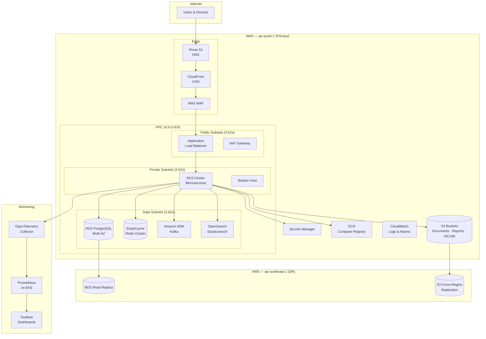

# 08 — Infrastructure & DevOps Architecture

## 1. AWS Infrastructure Diagram



---

## 2. Environment Strategy

| Environment | Purpose | Infrastructure | Data |
|-------------|---------|----------------|------|
| `dev` | Developer local + shared dev | Docker Compose / Minikube | Synthetic |
| `staging` | QA, UAT, integration testing | EKS (2 nodes) + RDS (small) | Anonymized prod copy |
| `production` | Live traffic | EKS (6-20 nodes) + RDS (Multi-AZ) | Real |
| `device-sandbox` | Device integration testing | Isolated EKS namespace | Simulated device data |

---

## 3. Kubernetes Architecture

```
Namespace: health-platform-prod
├── Deployments
│   ├── api-gateway          (2-4 replicas)
│   ├── auth-service         (2-3 replicas)
│   ├── tenant-service       (2 replicas)
│   ├── patient-service      (3-6 replicas)
│   ├── lims-service         (3-10 replicas)
│   ├── device-service       (2-4 replicas)
│   ├── ehr-service          (2-3 replicas)
│   ├── pms-service          (2-3 replicas)
│   ├── billing-service      (2-4 replicas)
│   ├── collection-service   (2-3 replicas)
│   ├── notification-service (2-3 replicas)
│   ├── report-service       (2-5 replicas)
│   ├── ai-analytics-service (2-3 replicas)
│   ├── integration-service  (2-3 replicas)
│   └── search-service       (2-3 replicas)
├── StatefulSets
│   └── (none — all state in RDS/Redis/ES)
├── Ingress
│   └── nginx-ingress (TLS via cert-manager)
├── ConfigMaps
│   └── app-config, feature-flags
└── Secrets (via External Secrets Operator)
    └── db-credentials, redis-credentials, jwt-secret, api-keys

Namespace: health-device-ingestion (isolated)
├── device-service (device-facing pods)
└── NetworkPolicy: allow only lab network CIDRs
```

---

## 4. Terraform Module Structure

```
infrastructure/
├── terraform/
│   ├── environments/
│   │   ├── dev/
│   │   │   ├── main.tf
│   │   │   ├── variables.tf
│   │   │   └── terraform.tfvars
│   │   ├── staging/
│   │   └── production/
│   ├── modules/
│   │   ├── vpc/
│   │   │   ├── main.tf          # VPC, subnets, NAT, IGW
│   │   │   ├── variables.tf
│   │   │   └── outputs.tf
│   │   ├── eks/
│   │   │   ├── main.tf          # EKS cluster, node groups
│   │   │   ├── iam.tf           # IRSA roles
│   │   │   └── outputs.tf
│   │   ├── rds/
│   │   │   ├── main.tf          # PostgreSQL Multi-AZ
│   │   │   └── outputs.tf
│   │   ├── elasticache/
│   │   │   └── main.tf          # Redis cluster
│   │   ├── s3/
│   │   │   └── main.tf          # Buckets + policies
│   │   ├── msk/
│   │   │   └── main.tf          # Kafka cluster
│   │   ├── opensearch/
│   │   │   └── main.tf          # Elasticsearch
│   │   ├── cloudfront/
│   │   │   └── main.tf          # CDN + WAF
│   │   └── monitoring/
│   │       └── main.tf          # Prometheus + Grafana on EKS
│   └── backend.tf               # S3 remote state
```

---

## 5. CI/CD Pipeline (GitHub Actions)

```mermaid
flowchart LR
    PUSH[Git Push] --> LINT[Lint & Type Check]
    LINT --> TEST[Unit Tests]
    TEST --> BUILD[Docker Build]
    BUILD --> SCAN[Security Scan<br/>Trivy]
    SCAN --> PUSH_ECR[Push to ECR]
    PUSH_ECR --> DEPLOY_STG[Deploy Staging]
    DEPLOY_STG --> E2E[E2E Tests]
    E2E --> APPROVE[Manual Approval]
    APPROVE --> DEPLOY_PROD[Deploy Production]
    DEPLOY_PROD --> SMOKE[Smoke Tests]
    SMOKE --> NOTIFY[Slack Notification]
```



### Pipeline Stages

| Stage | Tools | Gate |
|-------|-------|------|
| Lint | ESLint, Prettier, tsc | Must pass |
| Unit Test | Jest (backend), Vitest (frontend) | > 80% coverage on critical paths |
| Integration Test | Testcontainers (PG, Redis) | Must pass |
| Build | Docker multi-stage build | Image size < 200MB |
| Security Scan | Trivy, Snyk | No critical CVEs |
| Deploy Staging | ArgoCD / kubectl | Auto on merge to `main` |
| E2E Test | Playwright | Must pass |
| Deploy Production | ArgoCD | Manual approval required |
| Smoke Test | Health check endpoints | Must pass |

---

## 6. Docker Compose (Local Development)

```yaml
# docker-compose.yml (development)
services:
  postgres:
    image: postgres:16
    ports: ["5432:5432"]
    environment:
      POSTGRES_DB: healthecosystem
      POSTGRES_USER: dev
      POSTGRES_PASSWORD: dev
    volumes:
      - pgdata:/var/lib/postgresql/data

  redis:
    image: redis:7-alpine
    ports: ["6379:6379"]

  elasticsearch:
    image: elasticsearch:8.12.0
    ports: ["9200:9200"]
    environment:
      discovery.type: single-node
      xpack.security.enabled: false

  # Backend services started individually via npm run start:dev
  # Frontend started via npm run dev

volumes:
  pgdata:
```

---

## 7. Monitoring & Observability

### Grafana Dashboards

| Dashboard | Metrics |
|-----------|---------|
| Platform Overview | Request rate, error rate, latency p50/p95/p99 |
| LIMS Operations | Samples/hr, TAT, pending verifications, rejection rate |
| Device Health | Device uptime, message throughput, parse errors, retry queue depth |
| Billing | Revenue/day, payment success rate, outstanding invoices |
| Infrastructure | CPU, memory, disk, pod count, RDS connections |
| Security | Failed logins, MFA events, audit log volume |
| Business KPIs | Patients registered, orders/day, reports released, collection completion rate |

### Prometheus Metrics (Custom)

```
# Sample metrics exposed by each service
healthplatform_http_requests_total{service, method, path, status}
healthplatform_http_request_duration_seconds{service, method, path}
healthplatform_samples_processed_total{branch_id, status}
healthplatform_device_messages_total{device_id, parse_status}
healthplatform_reports_generated_total{branch_id}
healthplatform_active_websocket_connections{service}
```

### Alerting Rules

| Alert | Condition | Severity | Channel |
|-------|-----------|----------|---------|
| High Error Rate | 5xx > 1% for 5min | Critical | PagerDuty |
| Device Offline | No heartbeat for 10min | Warning | Slack |
| DB Connection Pool | > 80% utilization | Warning | Slack |
| Report Queue Backlog | > 100 pending for 15min | Warning | Slack |
| Failed Login Spike | > 50/min per tenant | Critical | PagerDuty + Security |
| Disk Usage | > 85% | Warning | Slack |

---

## 8. Backup & Disaster Recovery

| Component | Backup Strategy | RPO | RTO |
|-----------|----------------|:---:|:---:|
| PostgreSQL | Automated daily snapshots + continuous WAL archiving | 5 min | 30 min |
| Redis | Daily RDB snapshot | 24 hr | 15 min |
| S3 | Cross-region replication (ap-south-1 → ap-southeast-1) | Near-zero | 1 hr |
| Elasticsearch | Daily snapshot to S3 | 24 hr | 1 hr |
| Kafka | Multi-AZ replication factor 3 | Near-zero | 15 min |

### DR Failover Procedure

1. Route 53 health check detects primary region failure
2. Promote RDS read replica in DR region
3. Scale EKS cluster in DR region
4. Update DNS to DR CloudFront distribution
5. Verify smoke tests pass
6. Notify operations team

---

## 9. Security Infrastructure

| Control | Implementation |
|---------|----------------|
| Network | VPC with private subnets; no public DB access |
| Encryption | TLS 1.3 everywhere; RDS/S3/EBS encrypted at rest |
| Secrets | AWS Secrets Manager + External Secrets Operator |
| IAM | IRSA for pod-level AWS permissions; least privilege |
| WAF | OWASP Top 10 rules; rate limiting; geo-blocking |
| Pod Security | Restricted pod security standards; no root containers |
| Network Policies | K8s NetworkPolicy per namespace |
| Vulnerability Scanning | Trivy on every image build; weekly full scan |

---

## 10. Cost Estimation (Production — Enterprise Tier)

| Service | Specification | Est. Monthly (USD) |
|---------|---------------|:------------------:|
| EKS | 6-20 nodes (m6i.xlarge) | $1,500 - $5,000 |
| RDS PostgreSQL | db.r6g.xlarge Multi-AZ | $800 |
| ElastiCache Redis | cache.r6g.large × 2 | $400 |
| OpenSearch | 3 × r6g.large.search | $600 |
| MSK | 3 × kafka.m5.large | $500 |
| S3 | 1TB storage + requests | $100 |
| CloudFront | 1TB transfer | $100 |
| NAT Gateway | 3 AZs | $300 |
| **Total** | | **$4,300 - $7,800** |

---

## 11. Approval Checklist

- [ ] AWS region selection (ap-south-1 primary) approved
- [ ] Environment strategy approved
- [ ] CI/CD pipeline stages approved
- [ ] Monitoring dashboard requirements approved
- [ ] DR strategy and RPO/RTO targets approved
