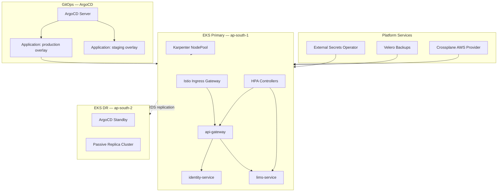
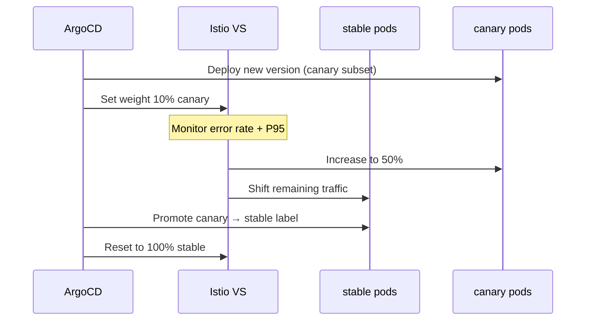

# 03 — Production Kubernetes Architecture

## 1. Executive Summary

HealthEcosystem production workloads run on **Amazon EKS** in `ap-south-1` (Mumbai) with **ArgoCD** GitOps delivery, **Istio** service mesh traffic management, **Karpenter** node autoscaling, and **multi-cluster DR** in `ap-south-2` (Hyderabad). Manifests live under `infrastructure/kubernetes/`.

---

## 2. Cluster Topology



---

## 3. Directory Layout

```
infrastructure/kubernetes/
├── base/                          # Shared manifests (Kustomize base)
│   ├── namespace.yaml
│   ├── kustomization.yaml
│   ├── configmap.yaml
│   ├── secrets.yaml
│   ├── serviceaccount.yaml
│   ├── deployments/               # api-gateway, identity-service, lims-service
│   ├── services/                  # ClusterIP services
│   └── hpa/                       # HorizontalPodAutoscalers
├── overlays/
│   ├── staging/                   # Reduced replicas, debug logging
│   └── production/                # Production replicas, affinity, image tags
├── argocd/application.yaml        # GitOps Application definitions
├── istio/                         # VirtualService + DestinationRule (canary)
├── external-secrets/                # AWS Secrets Manager integration
├── velero/backup-schedule.yaml    # Daily cluster backup
└── crossplane/provider-config.yaml  # AWS infra provisioning stub
```

---

## 4. Amazon EKS

### 4.1 Cluster Configuration

| Setting | Primary (Mumbai) | DR (Hyderabad) |
|---------|------------------|----------------|
| Region | `ap-south-1` | `ap-south-2` |
| Kubernetes | 1.29+ | 1.29+ |
| Node strategy | Karpenter NodePools | Karpenter (smaller pool) |
| VPC CIDR | `10.0.0.0/16` | `10.1.0.0/16` |
| AZs | 3 | 3 |

### 4.2 Karpenter Node Autoscaling

Karpenter provisions nodes on demand based on pending pod scheduling, replacing static node group sizing:

```yaml
# Example NodePool (managed outside base kustomize)
apiVersion: karpenter.sh/v1
kind: NodePool
metadata:
  name: healthecosystem-general
spec:
  template:
    spec:
      requirements:
        - key: karpenter.sh/capacity-type
          operator: In
          values: ["on-demand", "spot"]
        - key: node.kubernetes.io/instance-type
          operator: In
          values: ["m6i.large", "m6i.xlarge", "c6i.xlarge"]
      nodeClassRef:
        group: karpenter.k8s.aws
        kind: EC2NodeClass
        name: healthecosystem-default
  limits:
    cpu: 500
    memory: 1000Gi
  disruption:
    consolidationPolicy: WhenEmptyOrUnderutilized
    consolidateAfter: 5m
```

**Why Karpenter over Cluster Autoscaler:** faster scale-out for LIMS throughput spikes (50k orders/hour), bin-packing efficiency, and spot instance support for non-critical workloads.

---

## 5. ArgoCD GitOps

ArgoCD watches the monorepo and syncs Kustomize overlays to each cluster.

| Application | Branch | Path | Namespace |
|-------------|--------|------|-----------|
| `healthecosystem-production` | `main` | `overlays/production` | `health-platform-prod` |
| `healthecosystem-staging` | `develop` | `overlays/staging` | `health-platform-staging` |

### Deploy Commands

```bash
# Manual validation (local)
kubectl kustomize infrastructure/kubernetes/overlays/staging
kubectl kustomize infrastructure/kubernetes/overlays/production

# Apply ArgoCD applications
kubectl apply -f infrastructure/kubernetes/argocd/application.yaml
```

### Sync Policy

- **Automated sync** with prune and self-heal enabled for production
- **Retry** with exponential backoff (5 attempts, max 3 min)
- **CreateNamespace=true** for first-time deploys

---

## 6. Istio Service Mesh

Istio provides mTLS, traffic splitting, retries, and outlier detection.

### 6.1 Canary Traffic Split

Production uses a **90/10 canary** split on `api-gateway` and **95/5** on `lims-service`:

| File | Purpose |
|------|---------|
| `istio/virtual-service.yaml` | Route weights, timeouts, retries |
| `istio/destination-rule.yaml` | Subsets (`stable` / `canary`), connection pools, outlier detection |

Canary pods are labeled `version: canary`; stable pods use `version: stable`.

### 6.2 Blue/Green Deployment Flow



1. Deploy new image with `version: canary` label
2. Istio routes 10% traffic to canary subset
3. Monitor Prometheus/Grafana for error rate and P95 latency
4. Gradually increase canary weight (10 → 50 → 100)
5. Relabel canary pods as stable; remove old stable replicas

---

## 7. Secrets Management

`external-secrets/external-secret.yaml` syncs secrets from **AWS Secrets Manager** into Kubernetes:

| Secret Key | AWS Path |
|------------|----------|
| `DATABASE_URL` | `healthecosystem/prod/database` |
| `JWT_SECRET` | `healthecosystem/prod/auth` |
| `INTERNAL_SERVICE_KEY` | `healthecosystem/prod/auth` |
| `REDIS_URL` | `healthecosystem/prod/redis` |

Authentication uses **IRSA** (IAM Roles for Service Accounts) on the `health-platform` ServiceAccount.

---

## 8. Backup & Disaster Recovery

### 8.1 Velero

Daily backups at 02:00 UTC to S3 (`healthecosystem-velero-backups`):

- Namespaces: `health-platform-prod`, `health-platform-staging`, `istio-system`, `argocd`
- EBS volume snapshots enabled
- 30-day retention (720h TTL)

### 8.2 Multi-Cluster DR

| Component | Primary | DR | Failover |
|-----------|---------|-----|----------|
| EKS Cluster | Mumbai active | Hyderabad standby | Route53 health check failover |
| RDS PostgreSQL | Multi-AZ primary | Cross-region read replica | Promote replica (RTO 15 min) |
| Redis | Cluster mode | Replica | Sentinel failover |
| S3 | `ap-south-1` | Cross-region replication | DNS cutover |
| ArgoCD | Active sync | Standby (read-only) | Manual promotion |

**Failover procedure:**

1. Route53 health check detects primary failure
2. Promote Hyderabad RDS read replica
3. ArgoCD DR cluster syncs latest known-good manifests
4. Update External Secrets region references
5. Scale DR EKS NodePool to production capacity
6. Verify Istio gateway endpoints and run k6 smoke tests

See also [Multi-Region DR & HA](../phase-11-17/02-multi-region-dr-ha.md).

---

## 9. Crossplane (Infrastructure as Code)

`crossplane/provider-config.yaml` provides a stub for provisioning AWS resources (RDS subnet groups, S3 buckets, ElastiCache) via Kubernetes CRDs. Crossplane complements Terraform for in-cluster infrastructure self-service.

---

## 10. Horizontal Pod Autoscaling

| Service | Min | Max (Base) | Max (Prod) | CPU Target |
|---------|-----|------------|------------|------------|
| api-gateway | 2 | 20 | 20 | 70% |
| lims-service | 3 | 30 | 30 | 65% |

Production overlay patches increase minimum replicas (api-gateway: 4, lims-service: 6) to absorb baseline load without cold-start latency.

---

## 11. Operational Runbook

### Apply Staging

```bash
kubectl apply -k infrastructure/kubernetes/overlays/staging
```

### Apply Production (via ArgoCD — preferred)

```bash
argocd app sync healthecosystem-production
argocd app wait healthecosystem-production --health
```

### Verify Deployment

```bash
kubectl -n health-platform-prod get deploy,svc,hpa
kubectl -n health-platform-prod rollout status deployment/prod-api-gateway
```

### Rollback

```bash
argocd app rollback healthecosystem-production
# Or: kubectl rollout undo deployment/prod-api-gateway -n health-platform-prod
```

---

## 12. Related Documents

| Document | Description |
|----------|-------------|
| [08 — Infrastructure & DevOps](../phase-1/08-infrastructure-devops.md) | Original infra architecture |
| [02 — Multi-Region DR](../phase-11-17/02-multi-region-dr-ha.md) | DR topology and failover |
| [02 — Performance Certification](./02-performance-certification.md) | Load test targets and results |
